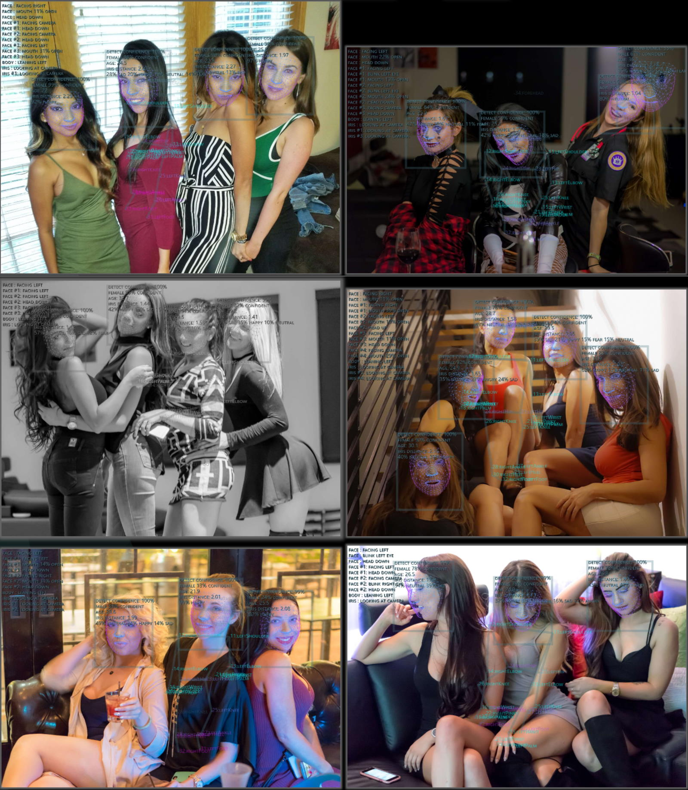

# Human Library

**3D Face Detection & Rotation Tracking, Face Embedding & Recognition,**  
**Body Pose Tracking, Hand & Finger Tracking,**  
**Iris Analysis, Age & Gender & Emotion Prediction**  
**& Gesture Recognition**

<br>

Native JavaScript module using TensorFlow/JS Machine Learning library  
Compatible with *Browser*, *WebWorker* and *NodeJS* execution on both Windows and Linux

- Browser/WebWorker: Compatible with *CPU*, *WebGL*, *WASM* and *WebGPU* backends  
- NodeJS: Compatible with software *tfjs-node* and CUDA accelerated backends *tfjs-node-gpu*  

Check out [**Live Demo**](https://vladmandic.github.io/human/demo/index.html) for processing of live WebCam video or static images  

<br>

## Project pages

- [**Live Demo**](https://vladmandic.github.io/human/demo/index.html)  
- [**Code Repository**](https://github.com/vladmandic/human)
- [**NPM Package**](https://www.npmjs.com/package/@vladmandic/human)
- [**Issues Tracker**](https://github.com/vladmandic/human/issues)
- [**Change Log**](https://github.com/vladmandic/human/CHANGELOG.md)

<br>

## Wiki pages

- [**Home**](https://github.com/vladmandic/human/wiki)
- [**Demos**](https://github.com/vladmandic/human/wiki/Demos)
- [**Installation**](https://github.com/vladmandic/human/wiki/Install)
- [**Usage & Functions**](https://github.com/vladmandic/human/wiki/Usage)
- [**Configuration Details**](https://github.com/vladmandic/human/wiki/Configuration)
- [**Output Details**](https://github.com/vladmandic/human/wiki/Outputs)
- [**Face Embedding and Recognition**](https://github.com/vladmandic/human/wiki/Embedding)
- [**Gesture Recognition**](https://github.com/vladmandic/human/wiki/Gesture)

<br>

## Additional notes

- [**Notes on Backends**](https://github.com/vladmandic/human/wiki/Backends)
- [**Development Server**](https://github.com/vladmandic/human/wiki/Development-Server)
- [**Build Process**](https://github.com/vladmandic/human/wiki/Build-Process)
- [**Performance Notes**](https://github.com/vladmandic/human/wiki/Performance)
- [**Performance Profiling**](https://github.com/vladmandic/human/wiki/Profiling)
- [**Platform Support**](https://github.com/vladmandic/human/wiki/Platforms)
- [**List of Models & Credits**](https://github.com/vladmandic/human/wiki/Models)

<br>

## Default models

Default models in Human library are:

- **Face Detection**: MediaPipe BlazeFace-Back
- **Face Mesh**: MediaPipe FaceMesh
- **Face Iris Analysis**: MediaPipe Iris
- **Emotion Detection**: Oarriaga Emotion
- **Gender Detection**: Oarriaga Gender
- **Age Detection**: SSR-Net Age IMDB
- **Body Analysis**: PoseNet
- **Face Embedding**: Sirius-AI MobileFaceNet Embedding

Note that alternative models are provided and can be enabled via configuration  
For example, `PoseNet` model can be switched for `BlazePose` model depending on the use case  

For more info, see [**Configuration Details**](https://github.com/vladmandic/human/wiki/Configuration) and [**List of Models**](https://github.com/vladmandic/human/wiki/Models)

<br>

*See [**issues**](https://github.com/vladmandic/human/issues?q=) and [**discussions**](https://github.com/vladmandic/human/discussions) for list of known limitations and planned enhancements*  

*Suggestions are welcome!*  

<br><hr><br>

## Options

As presented in the demo application...


<br><hr><br>

## Examples

<br>

**Training image:**  


**Using static images:**  



**Live WebCam view:**  


<br><hr><br>

Example simple app that uses Human to process video input and  
draw output on screen using internal draw helper functions

```js
import Human from '@vladmandic/human';

// create instance of human with simple configuration using default values
const config = { backend: 'webgl' };
const human = new Human(config);

function detectVideo() {
  // select input HTMLVideoElement and output HTMLCanvasElement from page
  const inputVideo = document.getElementById('video-id');
  const outputCanvas = document.getElementById('canvas-id');
  // perform processing using default configuration
  human.detect(inputVideo).then((result) => {
    // result object will contain detected details
    // as well as the processed canvas itself
    // so lets first draw processed frame on canvas
    human.draw.canvas(result.canvas, outputCanvas);
    // then draw results on the same canvas
    human.draw.face(outputCanvas, result.face);
    human.draw.body(outputCanvas, result.body);
    human.draw.hand(outputCanvas, result.hand);
    human.draw.gesture(outputCanvas, result.gesture);
    // loop immediate to next frame
    requestAnimationFrame(detectVideo);
  });
}

detectVideo();
```

<br>


