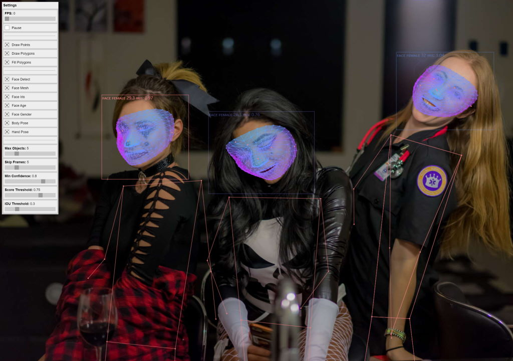

# Human: 3D Face Detection, Body Pose, Hand & Finger Tracking, Iris Tracking and Age & Gender Prediction

**Code Repository**: <https://github.com/vladmandic/human>  
**Documentation**: <https://github.com/vladmandic/human#readme>  
**Live Demo**: <https://vladmandic.github.io/human/demo/demo-esm.html>  

*Suggestions are welcome!*



<hr>

## Credits

This is an amalgamation of multiple existing models:

- Face Detection: [**MediaPipe BlazeFace**](https://drive.google.com/file/d/1f39lSzU5Oq-j_OXgS67KfN5wNsoeAZ4V/view)
- Facial Spacial Geometry: [**MediaPipe FaceMesh**](https://drive.google.com/file/d/1VFC_wIpw4O7xBOiTgUldl79d9LA-LsnA/view)
- Eye Iris Details: [**MediaPipe Iris**](https://drive.google.com/file/d/1bsWbokp9AklH2ANjCfmjqEzzxO1CNbMu/view)
- Hand Detection & Skeleton: [**MediaPipe HandPose**](https://drive.google.com/file/d/1sv4sSb9BSNVZhLzxXJ0jBv9DqD-4jnAz/view)
- Body Pose Detection: [**PoseNet**](https://medium.com/tensorflow/real-time-human-pose-estimation-in-the-browser-with-tensorflow-js-7dd0bc881cd5)
- Age & Gender Prediction: [**SSR-Net**](https://github.com/shamangary/SSR-Net)

<hr>

## Installation

**Important**  
*The packaged (IIFE and ESM) version of `Human` includes `TensorFlow/JS (TFJS) 2.6.0` library which can be accessed via `human.tf`*  
*You should NOT manually load another instance of `tfjs`, but if you do, be aware of possible version conflicts*  

There are multiple ways to use `Human` library, pick one that suits you:

### 1. IIFE script

This is simplest way for usage within Browser
Simply download `dist/human.js`, include it in your `HTML` file & it's ready to use.

```html
<script src="dist/human.js"><script>
``` 

IIFE script auto-registers global namespace `human` within Window object  
Script is distributed in minified form with attached sourcemap  

### 2. ESM module

#### 2.1 With Bundler

If you're using bundler *(such as rollup, webpack, esbuild)* to package your client application, you can import ESM version of `Human` library which supports full tree shaking  

```js
  import human from 'dist/human.esm.js';
```

#### 2.2 Using Script Module
You could use same syntax within your main `JS` file if it's imported with `<script type="module">`  

```html
  <script src="./index.js" type="module">
```
and then in your `index.js`

```js
  import human from 'dist/human.esm.js';
```

Script is distributed in minified form with attached sourcemap  

### 3. NPM module

Recommended for `NodeJS` projects  

Entry point is actual source `build/src/index.js`  
You also need to install and includ `tfjs` in your project  

Install with:
```shell
  npm install @tensorflow/tfjs @vladmandic/human
```
And then use with:
```js
  import * as tf from '@tensorflow/tfjs';
  import human from '@vladmandic/Human';
```

### Weights

Pretrained model weights are includes in `./models`  
Default configuration uses relative paths to you entry script pointing to `../models`  
If your application resides in a different folder, modify `modelPath` property in configuration of each module  

<hr>

## Demo

Demos are included in `/demo`:

- `demo-esm`: Demo using ESM module
- `demo-iife`: Demo using IIFE module

Both demos are identical, they just illustrate different ways to load `Human` library

<hr>

## Usage

`Human` library does not require special initialization.
All configuration is done in a single JSON object and all model weights will be dynamically loaded upon their first usage(and only then, `Human` will not load weights that it doesn't need according to configuration).

There is only *ONE* method you need:

```js
import * as tf from '@tensorflow/tfjs';
import human from '@vladmandic/human';

// 'image': can be of any type of an image object: HTMLImage, HTMLVideo, HTMLMedia, Canvas, Tensor4D
// 'options': optional parameter used to override any options present in default configuration
const results = await human.detect(image, options?)
```

Additionally, `Human` library exposes several classes:

```js
human.defaults // default configuration object
human.models   // dynamically maintained object of any loaded models
human.tf       // instance of tfjs used by human
```

<hr>

## Configuration 

Below is output of `human.defaults` object  
Any property can be overriden by passing user object during `human.detect()`  
Note that user object and default configuration are merged using deep-merge, so you do not need to redefine entire configuration  

```js
human.defaults = {
  face: {
    enabled: true,
    detector: {
      modelPath: '../models/human/blazeface/model.json',
      maxFaces: 10,
      skipFrames: 5,
      minConfidence: 0.8,
      iouThreshold: 0.3,
      scoreThreshold: 0.75,
    },
    mesh: {
      enabled: true,
      modelPath: '../models/human/facemesh/model.json',
    },
    iris: {
      enabled: true,
      modelPath: '../models/human/iris/model.json',
    },
    age: {
      enabled: true,
      modelPath: '../models/human/ssrnet-imdb-age/model.json',
      skipFrames: 5,
    },
    gender: {
      enabled: true,
      modelPath: '../models/human/ssrnet-imdb-gender/model.json',
    },
  },
  body: {
    enabled: true,
    modelPath: '../models/human/posenet/model.json',
    maxDetections: 5,
    scoreThreshold: 0.75,
    nmsRadius: 20,
  },
  hand: {
    enabled: true,
    skipFrames: 5,
    minConfidence: 0.8,
    iouThreshold: 0.3,
    scoreThreshold: 0.75,
    detector: {
      anchors: '../models/human/handdetect/anchors.json',
      modelPath: '../models/human/handdetect/model.json',
    },
    skeleton: {
      modelPath: '../models/human/handskeleton/model.json',
    },
  },
};
```

Where:
- `enabled`: controls if specified modul is enabled (note: module is not loaded until it is required)
- `modelPath`: path to specific pre-trained model weights
- `maxFaces`, `maxDetections`: how many faces or people are we trying to analyze. limiting number in busy scenes will result in higher performance
- `skipFrames`: how many frames to skip before re-running bounding box detection (e.g., face position does not move fast within a video, so it's ok to use previously detected face position and just run face geometry analysis)
- `minConfidence`: threshold for discarding a prediction
- `iouThreshold`: threshold for deciding whether boxes overlap too much in non-maximum suppression
- `scoreThreshold`: threshold for deciding when to remove boxes based on score in non-maximum suppression
- `nmsRadius`: radius for deciding points are too close in non-maximum suppression

<hr>

## Outputs

Result of `humand.detect()` is a single object that includes data for all enabled modules and all detected objects:

```js
result = {
  face: // <array of detected objects>
  [
    {
      confidence:  // <number>
      box:         // <array [x, y, width, height]>
      mesh:        // <array of 3D points [x, y, z]> (468 base points & 10 iris points)
      annotations: // <list of object { landmark: array of points }> (32 base annotated landmarks & 2 iris annotations)
      iris:        // <number> (relative distance of iris to camera, multiple by focal lenght to get actual distance)
      age:         // <number> (estimated age)
      gender:      // <string> (male or female)
    }
  ],
  body: // <array of detected objects>
  [
    {
      score:       // <number>,
      keypoints:   // <array of 2D landmarks [ score, landmark, position [x, y] ]> (17 annotated landmarks)
    }
  ],
  hand:            // <array of detected objects>
  [
    {
      confidence:    // <number>,
      box:           // <array [x, y, width, height]>,
      landmarks:     // <array of 3D points [x, y,z]> (21 points)
      annotations:   // <array of 3D landmarks [ landmark: <array of points> ]> (5 annotated landmakrs)
    }
  ]
}
```

<hr>

## Build

If you want to modify the library and perform a full rebuild:  
*clone repository, install dependencies, check for errors and run full rebuild from which creates bundles from `/src` into `/dist`:*

```shell
git clone https://github.com/vladmandic/human
cd human
npm install # installs all project dependencies
npm run lint
npm run build
```

Project is written in pure `JavaScript`, [ECMAScript version 2020](https://www.ecma-international.org/ecma-262/11.0/index.html)  

Only project depdendency is [@tensorflow/tfjs](https://github.com/tensorflow/tfjs), the rest are devDependencies tools: [eslint](https://github.com/eslint) used for linting and [esbuild](https://github.com/evanw/esbuild) used for bundling  

<hr>

## Performance

Performance will vary depending on your hardware, but also on number of resolution of input video/image, enabled modules as well as their parameters  

For example, on a desktop with a low-end nVidia GTX1050 it can perform multiple face detections at 50+ FPS, but drops to 5-10 FPS on a medium complex images if all modules are enabled  

Library can also be used on mobile devices  

<hr>

## Todo

- Improve detection of smaller faces
- Fix memory leak in face detector
