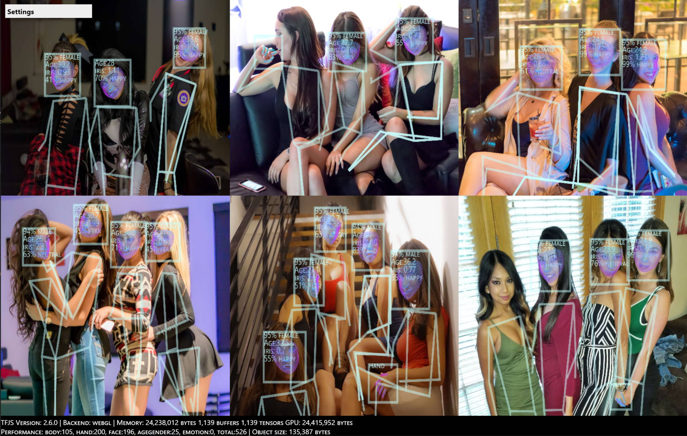
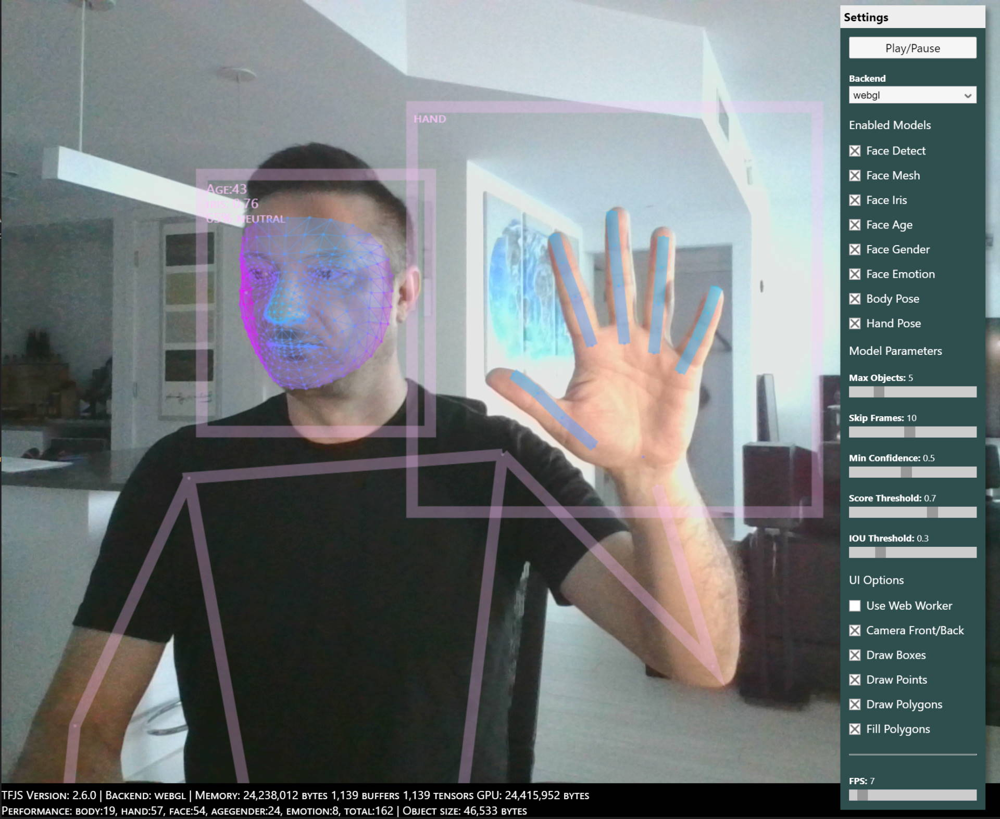

# Human Library

## 3D Face Detection, Body Pose, Hand & Finger Tracking, Iris Tracking, Age & Gender Prediction & Emotion Prediction

- [**Documentation**](https://github.com/vladmandic/human#readme)
- [**Code Repository**](https://github.com/vladmandic/human)
- [**NPM Package**](https://www.npmjs.com/package/@vladmandic/human)
- [**Issues Tracker**](https://github.com/vladmandic/human/issues)
- [**Change Log**](./CHANGELOG.md)
- [**Live Demo**](https://vladmandic.github.io/human/demo/index.html)

Compatible with Browser, WebWorker and NodeJS execution!  
(and maybe with React-Native as it doesn't use any DOM objects)  

*This is a pre-release project, see [issues](https://github.com/vladmandic/human/issues) for list of known limitations and planned enhancements*  

*Suggestions are welcome!*

<hr>

## Examples

**Using static images:**  


**Using webcam:**  


<hr>

## Installation

**Important**  
*The packaged (IIFE and ESM) version of `Human` includes `TensorFlow/JS (TFJS) 2.7.0` library which can be accessed via `human.tf`*  
*You should NOT manually load another instance of `tfjs`, but if you do, be aware of possible version conflicts*  

There are multiple ways to use `Human` library, pick one that suits you:

### Included

- `dist/human.js`: IIFE format bundle with TFJS for Browsers
- `dist/human.esm.js`: ESM format bundle with TFJS for Browsers
- `dist/human.esm-nobundle.js`: ESM format bundle without TFJS for Browsers
- `dist/human.cjs`: CommonJS format bundle without TFJS for NodeJS

All versions include `sourcemap` and build `manifest`  
While `Human` is in pre-release mode, all bundles are non-minified  

Defaults:
```json
  {
    "main": "dist/human.cjs",
    "module": "dist/human.esm.js",
    "browser": "dist/human.esm.js",
  }
```

### 1. [IIFE](https://developer.mozilla.org/en-US/docs/Glossary/IIFE) script

*Simplest way for usage within Browser*

Simply download `dist/human.js`, include it in your `HTML` file & it's ready to use.

```html
  <script src="dist/human.js"><script>
``` 

IIFE script auto-registers global namespace `Human` within global `Window` object  
Which you can use to create instance of `human` library: 

```js
  const human = new Human();
```

This way you can also use `Human` library within embbedded `<script>` tag within your `html` page for all-in-one approach  

### 2. [ESM](https://developer.mozilla.org/en-US/docs/Web/JavaScript/Reference/Statements/import) module

*Recommended for usage within `Browser`*  

#### **2.1 Using Script Module**
You could use same syntax within your main `JS` file if it's imported with `<script type="module">`  

```html
  <script src="./index.js" type="module">
```
and then in your `index.js`

```js
  import Human from 'dist/human.esm.js'; // for direct import must use path to module, not package name
  const human = new Human();
```

#### **2.2 With Bundler**

If you're using bundler *(such as rollup, webpack, parcel, browserify, esbuild)*  to package your client application,  
you can import ESM version of `Human` library which supports full tree shaking  

Install with:
```shell
  npm install @vladmandic/human
```
```js
  import Human from '@vladmandic/human'; // points to @vladmandic/human/dist/human.esm.js
                                         // you can also force-load specific version
                                         // for example: `@vladmandic/human/dist/human.esm.js`
  const human = new Human();
```

Or if you prefer to package your version of `tfjs`, you can use `nobundle` version

Install with:
```shell
  npm install @vladmandic/human @tensorflow/tfjs-node
```
```js
  import tf from '@tensorflow/tfjs'
  import Human from '@vladmandic/human/dist/human.esm-nobundle.js'; // same functionality as default import, but without tfjs bundled
  const human = new Human();
```

### 3. [NPM](https://www.npmjs.com/) module

*Recommended for `NodeJS` projects that will execute in the backend*  

Entry point is bundle in CJS format `dist/human.node.js`  
You also need to install and include `tfjs-node` or `tfjs-node-gpu` in your project so it can register an optimized backend  

Install with:
```shell
  npm install @vladmandic/human @tensorflow/tfjs-node
```
And then use with:
```js
  const tf = require('@tensorflow/tfjs-node'); // can also use '@tensorflow/tfjs-node-gpu' if you have environment with CUDA extensions
  const Human = require('@vladmandic/human').default; // points to @vladmandic/human/dist/human.cjs
  const human = new Human();
```

Since NodeJS projects load `weights` from local filesystem instead of using `http` calls, you must modify default configuration to include correct paths with `file://` prefix  

For example:
```js
const config = {
  body: { enabled: true, modelPath: 'file://models/posenet/model.json' },
}
```

### Weights

Pretrained model weights are includes in `./models`  
Default configuration uses relative paths to you entry script pointing to `../models`  
If your application resides in a different folder, modify `modelPath` property in configuration of each module  

<hr>

## Demo

Demos are included in `/demo`:

Browser:
- `index.html`, `browser.js`, `worker.js`: Full demo using Browser with ESM module, includes selectable backends and webworkers

NodeJS:
- `node.js`: Demo using NodeJS with CJS module  
  This is a very simple demo as althought `Human` library is compatible with NodeJS execution  
  and is able to load images and models from local filesystem,  

<hr>

## Usage

`Human` library does not require special initialization.
All configuration is done in a single JSON object and all model weights will be dynamically loaded upon their first usage  
(and only then, `Human` will not load weights that it doesn't need according to configuration).

There is only *ONE* method you need:

```js
  // 'image': can be of any type of an image object: HTMLImage, HTMLVideo, HTMLMedia, Canvas, Tensor4D  
  // 'config': optional parameter used to override any options present in default configuration  
  // configuration is fully dynamic and can change between different calls to 'detect()'  
  const result = await human.detect(image, config?)
```

or if you want to use promises

```js
  human.detect(image, config?).then((result) => {
    // your code
  })
```

Additionally, `Human` library exposes several objects and methods:

```js
  human.config        // access to configuration object, normally set as parameter to detect()
  human.defaults      // read-only view of default configuration object
  human.models        // dynamically maintained list of object of any loaded models
  human.tf            // instance of tfjs used by human
  human.state         // <string> describing current operation in progress
                      // progresses through: 'config', 'check', 'backend', 'load', 'run:<model>', 'idle'
  human.load(config)  // explicitly call load method that loads configured models
                      // if you want to pre-load them instead of on-demand loading during 'human.detect()'
```

Note that when using `Human` library in `NodeJS`, you must load and parse the image *before* you pass it for detection and dispose it afterwards  
Input format is `Tensor4D[1, width, height, 3]` of type `float32` 

For example:
```js
  const imageFile = '../assets/sample1.jpg';
  const buffer = fs.readFileSync(imageFile);
  const decoded = tf.node.decodeImage(buffer);
  const casted = decoded.toFloat();
  const image = casted.expandDims(0);
  decoded.dispose();
  casted.dispose();
  logger.log('Processing:', image.shape);
  const human = new Human.Human();
  const result = await human.detect(image, config);
  image.dispose();
```

<hr>

## Configuration 

Detailed configuration options are explained below, but they are best seen in the menus present in the `demo` application:  

  

Below is output of `human.defaults` object  
Any property can be overriden by passing user object during `human.detect()`  
Note that user object and default configuration are merged using deep-merge, so you do not need to redefine entire configuration  

Configurtion object is large, but typically you only need to modify few values:

- `enabled`: Choose which models to use
- `modelPath`: Update as needed to reflect your application's relative path


```js
config = {
  backend: 'webgl',          // select tfjs backend to use
  console: true,             // enable debugging output to console
  scoped: false,             // enable scoped runs
                             // some models *may* have memory leaks, this wrapps everything in a local scope at a cost of performance
                             // typically not needed
  videoOptimized: true,      // perform additional optimizations when input is video, must be disabled for images
  filter: {                  // note: image filters are only available in Browser environments and not in NodeJS as they require WebGL for processing
    enabled: true,           // enable image pre-processing filters
    return: true,            // return processed canvas imagedata in result
    width: 0,                // resize input width
    height: 0,               // resize input height
                             // usefull on low-performance devices to reduce the size of processed input
                             // if both width and height are set to 0, there is no resizing
                             // if just one is set, second one is scaled automatically
                             // if both are set, values are used as-is
    brightness: 0,           // range: -1 (darken) to 1 (lighten)
    contrast: 0,             // range: -1 (reduce contrast) to 1 (increase contrast)
    sharpness: 0,            // range: 0 (no sharpening) to 1 (maximum sharpening)
    blur: 0,                 // range: 0 (no blur) to N (blur radius in pixels)
    saturation: 0,           // range: -1 (reduce saturation) to 1 (increase saturation)
    hue: 0,                  // range: 0 (no change) to 360 (hue rotation in degrees)
    negative: false,         // image negative
    sepia: false,            // image sepia colors
    vintage: false,          // image vintage colors
    kodachrome: false,       // image kodachrome colors
    technicolor: false,      // image technicolor colors
    polaroid: false,         // image polaroid camera effect
    pixelate: 0,             // range: 0 (no pixelate) to N (number of pixels to pixelate)
  },
  face: {
    enabled: true,           // controls if specified modul is enabled
                             // face.enabled is required for all face models: detector, mesh, iris, age, gender, emotion
                             // note: module is not loaded until it is required
    detector: {
      modelPath: '../models/blazeface/back/model.json', // can be 'front' or 'back'.
                                                        // 'front' is optimized for large faces such as front-facing camera and 'back' is optimized for distanct faces.
      inputSize: 256,        // fixed value: 128 for front and 256 for 'back'
      maxFaces: 10,          // maximum number of faces detected in the input, should be set to the minimum number for performance
      skipFrames: 10,        // how many frames to go without re-running the face bounding box detector
                             // only used for video inputs, ignored for static inputs
                             // if model is running st 25 FPS, we can re-use existing bounding box for updated face mesh analysis
                             // as the face probably hasn't moved much in short time (10 * 1/25 = 0.25 sec)
      minConfidence: 0.5,    // threshold for discarding a prediction
      iouThreshold: 0.3,     // threshold for deciding whether boxes overlap too much in non-maximum suppression
      scoreThreshold: 0.7,   // threshold for deciding when to remove boxes based on score in non-maximum suppression
    },
    mesh: {
      enabled: true,
      modelPath: '../models/facemesh/model.json',
      inputSize: 192,        // fixed value
    },
    iris: {
      enabled: true,
      modelPath: '../models/iris/model.json',
      enlargeFactor: 2.3,    // empiric tuning
      inputSize: 64,         // fixed value
    },
    age: {
      enabled: true,
      modelPath: '../models/ssrnet-age/imdb/model.json', // can be 'imdb' or 'wiki'
                                                         // which determines training set for model
      inputSize: 64,         // fixed value
      skipFrames: 10,        // how many frames to go without re-running the detector, only used for video inputs
    },
    gender: {
      enabled: true,
      minConfidence: 0.8,    // threshold for discarding a prediction
      modelPath: '../models/ssrnet-gender/imdb/model.json',
    },
    emotion: {
      enabled: true,
      inputSize: 64,         // fixed value
      minConfidence: 0.5,    // threshold for discarding a prediction
      skipFrames: 10,        // how many frames to go without re-running the detector, only used for video inputs
      modelPath: '../models/emotion/model.json',
    },
  },
  body: {
    enabled: true,
    modelPath: '../models/posenet/model.json',
    inputResolution: 257,    // fixed value
    outputStride: 16,        // fixed value
    maxDetections: 10,       // maximum number of people detected in the input, should be set to the minimum number for performance
    scoreThreshold: 0.7,     // threshold for deciding when to remove boxes based on score in non-maximum suppression
    nmsRadius: 20,           // radius for deciding points are too close in non-maximum suppression
  },
  hand: {
    enabled: true,
    inputSize: 256,          // fixed value
    skipFrames: 10,          // how many frames to go without re-running the hand bounding box detector
                             // only used for video inputs
                             // if model is running st 25 FPS, we can re-use existing bounding box for updated hand skeleton analysis
                             // as the hand probably hasn't moved much in short time (10 * 1/25 = 0.25 sec)
    minConfidence: 0.5,      // threshold for discarding a prediction
    iouThreshold: 0.3,       // threshold for deciding whether boxes overlap too much in non-maximum suppression
    scoreThreshold: 0.7,     // threshold for deciding when to remove boxes based on score in non-maximum suppression
    enlargeFactor: 1.65,     // empiric tuning as skeleton prediction prefers hand box with some whitespace
    maxHands: 10,            // maximum number of hands detected in the input, should be set to the minimum number for performance
    detector: {
      anchors: '../models/handdetect/anchors.json',
      modelPath: '../models/handdetect/model.json',
    },
    skeleton: {
      modelPath: '../models/handskeleton/model.json',
    },
  },
};
```

<hr>

## Outputs

Result of `humand.detect()` is a single object that includes data for all enabled modules and all detected objects:

```js
result = {
  version:         // <string> version string of the human library
  face:            // <array of detected objects>
  [
    {
      confidence,  // <number>
      box,         // <array [x, y, width, height]>
      mesh,        // <array of 3D points [x, y, z]> 468 base points & 10 iris points
      annotations, // <list of object { landmark: array of points }> 32 base annotated landmarks & 2 iris annotations
      iris,        // <number> relative distance of iris to camera, multiple by focal lenght to get actual distance
      age,         // <number> estimated age
      gender,      // <string> 'male', 'female'
    }
  ],
  body:            // <array of detected objects>
  [
    {
      score,       // <number>,
      keypoints,   // <array of 2D landmarks [ score, landmark, position [x, y] ]> 17 annotated landmarks
    }
  ],
  hand:            // <array of detected objects>
  [
    {
      confidence,  // <number>,
      box,         // <array [x, y, width, height]>,
      landmarks,   // <array of 3D points [x, y,z]> 21 points
      annotations, // <array of 3D landmarks [ landmark: <array of points> ]> 5 annotated landmakrs
    }
  ],
  emotion:         // <array of emotions>
  [
    {
      score,       // <number> probabily of emotion
      emotion,     // <string> 'angry', 'discust', 'fear', 'happy', 'sad', 'surpise', 'neutral'
    }
  ],
  performance = {  // performance data of last execution for each module measuredin miliseconds
    backend,       // time to initialize tf backend
    load,          // time to load models
    image,         // time for image processing
    body,          // model time
    hand,          // model time
    face,          // model time
    agegender,     // model time
    emotion,       // model time
    total,         // end to end time
  }
}
```

<hr>

## Build

If you want to modify the library and perform a full rebuild:  

*clone repository, install dependencies, check for errors and run full rebuild from which creates bundles from `/src` into `/dist`:*

```shell
git clone https://github.com/vladmandic/human
cd human
npm install # installs all project dependencies
npm run lint
npm run build
```

Project is written in pure `JavaScript` [ECMAScript version 2020](https://www.ecma-international.org/ecma-262/11.0/index.html)  

Only project depdendency is [@tensorflow/tfjs](https://github.com/tensorflow/tfjs)
Development dependencies are [eslint](https://github.com/eslint) used for code linting and [esbuild](https://github.com/evanw/esbuild) used for IIFE and ESM script bundling  

<hr>

## Performance

Performance will vary depending on your hardware, but also on number of resolution of input video/image, enabled modules as well as their parameters  

For example, it can perform multiple face detections at 60+ FPS, but drops to ~15 FPS on a medium complex images if all modules are enabled  

### Performance per module on a **notebook** with nVidia GTX1050 GPU on a FullHD input:

- Enabled all: 15 FPS
- Image filters: 80 FPS (standalone)
- Face Detect: 80 FPS (standalone)
- Face Geometry: 30 FPS (includes face detect)
- Face Iris: 30 FPS (includes face detect and face geometry)
- Age: 60 FPS (includes face detect)
- Gender: 60 FPS (includes face detect)
- Emotion: 60 FPS (includes face detect)
- Hand: 40 FPS (standalone)
- Body: 50 FPS (standalone)

### Performance per module on a **smartphone** with Snapdragon 855 on a FullHD input:

- Enabled all: 3 FPS
- Image filters: 30 FPS (standalone)
- Face Detect: 20 FPS (standalone)
- Face Geometry: 10 FPS (includes face detect)
- Face Iris: 5 FPS (includes face detect and face geometry)
- Age: 20 FPS (includes face detect)
- Gender: 20 FPS (includes face detect)
- Emotion: 20 FPS (includes face detect)
- Hand: 40 FPS (standalone)
- Body: 10 FPS (standalone)

For performance details, see output of `result.performance` object during runtime  

<hr>

## Limitations

`Human` library can be used in any modern Browser or NodeJS environment, but there are several items to be aware of:

- **NodeJS**: Due to a missing feature in `tfjs-node`, only some models are available  
  For unsupported models, error is: `TypeError: forwardFunc is not a function`  
  <https://github.com/tensorflow/tfjs/issues/4066>  
- **Browser**: Module `filters` cannot be used when using web workers  
  <https://github.com/phoboslab/WebGLImageFilter/issues/27>  

<hr>

## Credits

- Face Detection: [**MediaPipe BlazeFace**](https://drive.google.com/file/d/1f39lSzU5Oq-j_OXgS67KfN5wNsoeAZ4V/view)
- Facial Spacial Geometry: [**MediaPipe FaceMesh**](https://drive.google.com/file/d/1VFC_wIpw4O7xBOiTgUldl79d9LA-LsnA/view)
- Eye Iris Details: [**MediaPipe Iris**](https://drive.google.com/file/d/1bsWbokp9AklH2ANjCfmjqEzzxO1CNbMu/view)
- Hand Detection & Skeleton: [**MediaPipe HandPose**](https://drive.google.com/file/d/1sv4sSb9BSNVZhLzxXJ0jBv9DqD-4jnAz/view)
- Body Pose Detection: [**PoseNet**](https://medium.com/tensorflow/real-time-human-pose-estimation-in-the-browser-with-tensorflow-js-7dd0bc881cd5)
- Age & Gender Prediction: [**SSR-Net**](https://github.com/shamangary/SSR-Net)
- Emotion Prediction: [**Oarriaga**](https://github.com/oarriaga/face_classification)
- Image Filters: [**WebGLImageFilter**](https://github.com/phoboslab/WebGLImageFilter)

<hr>
